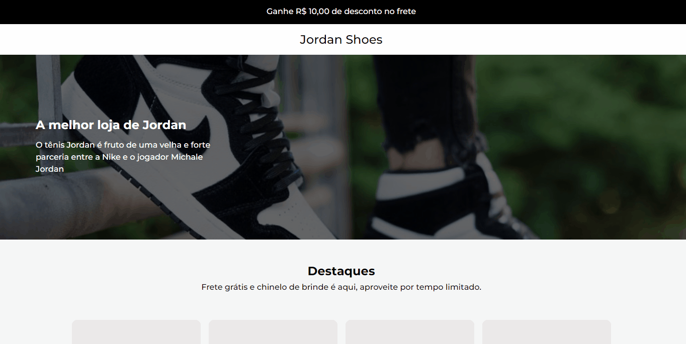

<div align="center">
 <h1>Jordan Shoe</h1>
 <h2>Project Description</h2>
 <p>Landing page of Jordan shoes</p>
<p>
 <a href="#Features">Features</a> •
 <a href="#Requirements">Requirements</a> • 
 <a href="#Running the Application">Running the Application</a> • 
 <a href="#Technologies">Technologies</a> • 
 <a href="#Author">Author</a>
</p>
 <br>
 
</div>
 
### Features

- [x] View the Jordan Shoes

### Requirements

Before you begin, you will need to have the following tools installed on your machine:
[Git](https://git-scm.com) and [Node.js](https://nodejs.org/en/)

### 🎲 Running the Application

```bash
# Clone this repository
$ git clone <https://github.com/JoaoVitorSoares10/Jordan-Shoe.git>
# Access the project folder in the terminal/cmd
$ cd Jordan-Shoe
# Install dependencies
$ npm install
# Run the application
$ npm start
# The server will log in to port:8000 - access <http://localhost:8000>
```

### 🛠 Technologies

The following tools were used in the construction of the project:

- [React](https://pt-br.reactjs.org/)
- [TypeScript](https://pt-br.reactjs.org/)
- [Styled-components](https://styled-components.com/)

### Author

<p>Create by <a href="https://www.linkedin.com/in/joao-vitor-morais-soares-49ba17228/">João Vitor</a></p>
